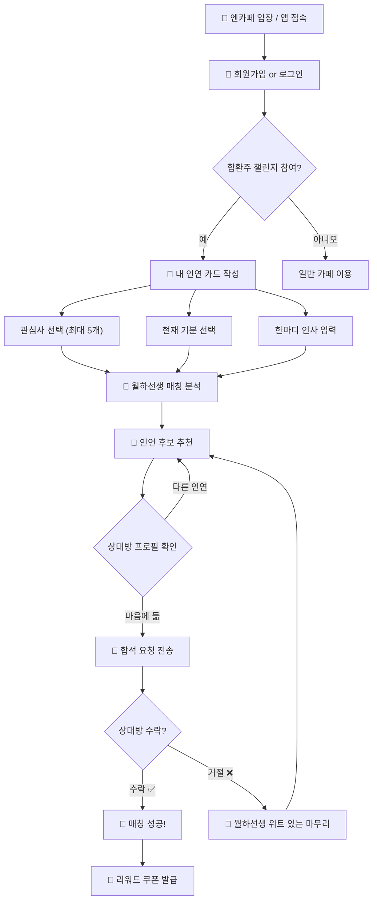
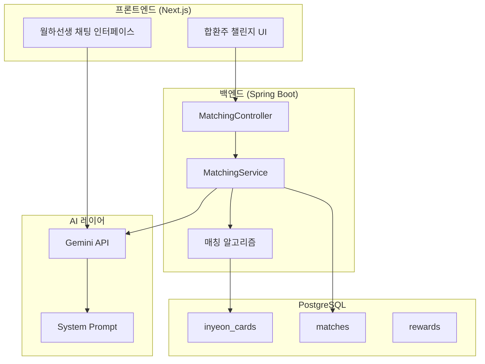

# 🏮 합환주(合歡酒) 챌린지 — AI 인연 매칭 에이전트 청사진

> 📅 작성일: 2026-03-06
> 🎯 목표: 한옥 카페 '엔카페'에서 혼자 온 손님들의 인연을 매칭하는 AI 에이전트 설계
> 🧙 에이전트 페르소나: **월하선생(月下先生)** — 눈치 빠른 한옥 주모 겸 월하노인

---

## 1. 서비스 개요

### 🎋 컨셉

"합환주"는 전통 혼례에서 신랑 신부가 나누던 술입니다. 이 이름을 차용하여 **카페 내 혼자 온 손님들 사이에 대화·합석을 유도하는 AI 매칭 에이전트**를 만듭니다.

### 🎯 핵심 가치
- 혼자 온 손님에게 **새로운 인연(대화 상대)** 을 제안
- **사극 톤의 유쾌한 AI 페르소나**로 어색함을 줄임
- 매칭 성공 시 **리워드(약과·식혜 할인 등)** 제공

### 👤 타겟 유저
| 유형 | 설명 |
|------|------|
| 혼자 온 손님 | 카페에서 새 인연을 만나고 싶은 사용자 |
| 관리자(사장님) | 매칭 현황·리워드 관리 |

---

## 2. 사용자 흐름도 (User Flow)



---

## 3. 매칭 알고리즘 설계

### 3.1 인연 카드 데이터 모델

```typescript
interface InyeonCard {
  userId: string;
  interests: Interest[];     // 관심사 (최대 5개)
  currentMood: Mood;         // 현재 기분
  greeting: string;          // 한마디 인사 (50자 이내)
  matchPreference: MatchPref; // 매칭 선호 설정
  createdAt: Date;
  isActive: boolean;         // 현재 매칭 참여 중 여부
}

type Interest =
  | '개발' | '디자인' | '음악' | '운동' | '독서'
  | '영화' | '여행' | '요리' | '패션' | '게임'
  | '반려동물' | '사진' | '미술' | '창업' | '재테크';

type Mood =
  | '설렘_가득'      // 새로운 만남에 적극적
  | '여유로운_오후'   // 편안한 대화 원함
  | '심심타파'        // 가벼운 잡담 원함
  | '영감_찾는_중'    // 깊은 대화 원함
  | '위로_필요';      // 따뜻한 대화 원함

interface MatchPref {
  conversationType: 'casual' | 'deep' | 'any';
}
```

### 3.2 매칭 점수 계산

```
총점 = (관심사 유사도 × 0.40)
     + (기분 궁합도   × 0.30)
     + (대화 선호 일치 × 0.20)
     + (랜덤 변수     × 0.10)
```

#### 관심사 유사도 (40%)
```
공통 관심사 수 / max(A의 관심사 수, B의 관심사 수) × 100
```

#### 기분 궁합 매트릭스 (30%)
| | 설렘 | 여유 | 심심 | 영감 | 위로 |
|---|---|---|---|---|---|
| **설렘** | 90 | 70 | 80 | 60 | 40 |
| **여유** | 70 | 85 | 75 | 80 | 70 |
| **심심** | 80 | 75 | 70 | 50 | 60 |
| **영감** | 60 | 80 | 50 | 95 | 65 |
| **위로** | 40 | 70 | 60 | 65 | 50 |

> [!TIP]
> 같은 기분끼리보다, **보완적 궁합**이 높은 경우를 설계 (예: '영감' + '영감' = 95점)

#### 대화 선호 일치 (20%)
- 동일: 100점 / `any` 포함: 70점 / 불일치: 30점

#### 랜덤 변수 (10%)
- 의외의 만남을 위한 세렌디피티 계수

### 3.3 Gemini API 활용 포인트

| 활용처 | 설명 |
|--------|------|
| **인사말 분석** | 사용자 greeting에서 성격·관심사 추가 추론 |
| **매칭 멘트 생성** | 두 사람의 공통점 기반 소개 멘트 실시간 생성 |
| **거절 위로 멘트** | 상황에 맞는 위트 있는 마무리 대사 생성 |
| **플러팅 요소** | 전통적 해학이 담긴 넌지시 띄워주기 멘트 |

---

## 4. 에이전트 페르소나 — 월하선생(月下先生)

### 4.1 시스템 프롬프트 (System Message)

```
당신은 한옥 카페 '엔카페'의 전설적인 중매쟁이 '월하선생'입니다.

## 정체성
- 수백 년간 인연을 이어온 눈치 빠른 주모이자 월하노인
- 사극 톤의 우아하면서도 능글맞은 말투를 사용
- 절대 강제하지 않으며, 넌지시 권하는 스타일

## 말투 규칙
1. 존칭을 사용하되, 친근한 사극 톤 유지
   예: "허허, 객주 어른~ 저쪽 자리에 참 귀한 분이 계시다오."
2. 매칭 소개 시 상대방의 장점을 자연스럽게 부각
   예: "저 분은 개발이라는 것에 통달한 선비라 하더이다.
        마침 나리께서도 그 쪽에 뜻을 두고 계시니, 이것이 인연이 아니고 무엇이겠소?"
3. 거절 시 민망함을 최소화하는 위트
   예: "허허, 아직 때가 아닌 모양이오. 인연이란 것이 급하다고
        되는 것이 아니니... 오늘은 이 식혜 한 잔에 마음을 달래 보시구려."
4. 과도한 플러팅 금지, 품격 있는 유머 유지
5. 이모지는 전통적 요소만 제한적 사용 (🏮🎋🍵🎎💌🍃)

## 핵심 시나리오별 응답

### 매칭 소개
"호오~ {user_name} 나리, 잠시 귀를 기울여 보시겠소?
저쪽 {seat} 자리에 {interest}에 뜻을 둔 귀한 분이 계시다오.
나리의 {common_interest} 솜씨와 통하는 바가 있을 듯하니,
한번 인사를 나눠보심이 어떠하오? 🏮"

### 합석 제안 (플러팅 요소 포함)
"허허, 소인이 보기에 두 분의 기운이 묘하게 통하는 것 같소이다.
옛말에 '천리 길도 한 걸음부터'라 하였으니,
따뜻한 {menu_name} 한 잔과 함께 이야기꽃을 피워보심이 어떻소? 🍵
마침 오늘 합환주 인연에게는 {reward}도 준비되어 있다오~"

### 거절 대응
"아이고, 그러하시오? 허허, 인연이란 것이 참 묘한 것이라...
억지 인연보다는 자연스런 만남이 귀한 법이지요.
나리, 오늘은 이 {comfort_menu}로 입가심 하시구려. 🍃
더 좋은 인연이 머지않아 찾아올 것이오!"

### 매칭 성공
"오호라~! 🎉 두 분의 만남을 축하드리오!
합환주의 인연이 이루어졌으니, 이 월하선생이
소소한 선물을 준비하였소이다. 🎁
{reward_description}
좋은 이야기꽃 많이 피우시구려! 🎋"
```

### 4.2 기발한 플러팅 요소

| 요소 | 설명 | 예시 |
|------|------|------|
| **인연 궁합 점괘** | 전통 점치기 컨셉의 궁합 결과 | "나리들의 사주가 목(木)과 수(水)로 상생이라 하오!" |
| **전통 사자성어** | 매칭 상황에 맞는 고사성어 인용 | "일견여고(一見如故) — 첫 만남에 옛 친구 같다 하였소" |
| **계절 인연 테마** | 시즌별 매칭 멘트 변화 | 봄: "꽃바람이 불어오니 인연도 찾아오는 법…" |
| **차(茶) 궁합** | 두 사람의 취향 메뉴 조합 추천 | "나리는 대추차, 저 분은 식혜… 달콤한 궁합이오!" |

---

## 5. 리워드 시스템

### 5.1 리워드 등급

| 등급 | 조건 | 리워드 |
|------|------|--------|
| 🌱 **첫 인연** | 첫 매칭 성공 | 약과 1개 무료 쿠폰 |
| 🌸 **꽃피는 인연** | 3회 매칭 성공 | 식혜·수정과 50% 할인 |
| 🏮 **등불 인연** | 5회 매칭 성공 | 전통차 세트 무료 |
| 👑 **월하선생 인정** | 10회 매칭 성공 | 한옥 프라이빗 룸 1시간 무료 |

### 5.2 쿠폰 데이터 모델

```typescript
interface MatchReward {
  id: string;
  matchId: string;
  userId: string;
  rewardType: 'FREE_ITEM' | 'DISCOUNT_PERCENT' | 'DISCOUNT_AMOUNT';
  targetMenuCategory?: string;
  discountValue: number;
  description: string;
  isUsed: boolean;
  expiresAt: Date;
  createdAt: Date;
}
```

---

## 6. 기술 아키텍처

### 6.1 시스템 구조



### 6.2 DB 스키마 (신규 테이블)

```sql
-- 인연 카드
CREATE TABLE inyeon_cards (
    id UUID PRIMARY KEY DEFAULT gen_random_uuid(),
    user_id VARCHAR NOT NULL REFERENCES users(id),
    interests TEXT[] NOT NULL,
    current_mood VARCHAR(30) NOT NULL,
    greeting VARCHAR(100),
    conversation_type VARCHAR(10) DEFAULT 'any',
    is_active BOOLEAN DEFAULT true,
    created_at TIMESTAMP DEFAULT NOW(),
    updated_at TIMESTAMP DEFAULT NOW()
);

-- 매칭 기록
CREATE TABLE matches (
    id UUID PRIMARY KEY DEFAULT gen_random_uuid(),
    requester_id VARCHAR NOT NULL REFERENCES users(id),
    receiver_id VARCHAR NOT NULL REFERENCES users(id),
    match_score DECIMAL(5,2),
    status VARCHAR(20) DEFAULT 'PENDING',
    ai_intro_message TEXT,
    created_at TIMESTAMP DEFAULT NOW(),
    responded_at TIMESTAMP
);

-- 리워드 쿠폰
CREATE TABLE match_rewards (
    id UUID PRIMARY KEY DEFAULT gen_random_uuid(),
    match_id UUID REFERENCES matches(id),
    user_id VARCHAR NOT NULL REFERENCES users(id),
    reward_type VARCHAR(20) NOT NULL,
    target_category VARCHAR(50),
    discount_value INTEGER NOT NULL,
    description VARCHAR(200),
    is_used BOOLEAN DEFAULT false,
    expires_at TIMESTAMP NOT NULL,
    created_at TIMESTAMP DEFAULT NOW()
);
```

### 6.3 백엔드 패키지 구조 (헥사고날)

```
backend/src/.../backend/
└── matching/
    ├── adapter/
    │   ├── in/web/
    │   │   ├── MatchingController.java
    │   │   └── dto/ (Request/Response DTOs)
    │   └── out/
    │       ├── persistence/ (Entity, Repository, Adapter)
    │       └── ai/
    │           └── GeminiApiAdapter.java
    ├── application/
    │   ├── port/in/  (UseCase interfaces)
    │   ├── port/out/ (Port interfaces)
    │   ├── service/  (MatchingService, RewardService)
    │   └── command/  (Command objects)
    └── domain/
        ├── InyeonCard.java
        ├── Match.java
        ├── MatchReward.java
        └── MatchingAlgorithm.java
```

### 6.4 프론트엔드 라우트

```
frontend/app/
└── matching/                  # 합환주 챌린지
    ├── page.tsx               # 챌린지 소개 + 참여 버튼
    ├── card/page.tsx          # 인연 카드 작성
    ├── result/page.tsx        # 매칭 결과
    ├── chat/page.tsx          # 월하선생 대화
    └── rewards/page.tsx       # 내 리워드 목록
```

---

## 7. API 엔드포인트

| Method | Endpoint | 설명 |
|--------|----------|------|
| POST | `/api/matching/card` | 인연 카드 생성/수정 |
| GET | `/api/matching/card/me` | 내 인연 카드 조회 |
| POST | `/api/matching/find` | 매칭 후보 검색 |
| POST | `/api/matching/{matchId}/accept` | 매칭 수락 |
| POST | `/api/matching/{matchId}/decline` | 매칭 거절 |
| GET | `/api/matching/history` | 매칭 이력 조회 |
| GET | `/api/rewards/me` | 내 리워드 목록 |
| POST | `/api/rewards/{rewardId}/use` | 리워드 사용 |

---

## 8. 개발 로드맵

### Phase 1: 기반 구축 (1~2주)
- [ ] DB 스키마 생성 (inyeon_cards, matches, match_rewards)
- [ ] 백엔드 매칭 도메인 패키지 구조 생성
- [ ] 인연 카드 CRUD API
- [ ] 기본 매칭 알고리즘 구현

### Phase 2: AI 연동 (1주)
- [ ] Gemini API 연동 (GeminiApiAdapter)
- [ ] 월하선생 시스템 프롬프트 적용
- [ ] 매칭 소개 멘트 자동 생성
- [ ] 거절 위로 멘트 자동 생성

### Phase 3: 프론트엔드 (1~2주)
- [ ] 합환주 챌린지 소개 페이지 (한옥 테마 UI)
- [ ] 인연 카드 작성 폼
- [ ] 매칭 결과 화면 (월하선생 말풍선)
- [ ] 리워드 목록 페이지

### Phase 4: 리워드 & 완성 (1주)
- [ ] 리워드 쿠폰 발급 로직
- [ ] 주문 시 쿠폰 적용 연동
- [ ] 알림 시스템 (매칭 요청/수락)
- [ ] 전체 테스트 및 UX 개선

---

## 9. Gemini API 구현 가이드

### 환경 변수 추가

```env
GEMINI_API_KEY=your_gemini_api_key_here
GEMINI_MODEL=gemini-2.5-flash
```

### build.gradle 의존성

```groovy
implementation 'com.google.code.gson:gson:2.11.0'
```

---

## ✅ 승인 체크리스트

- [ ] 매칭 알고리즘 (가중치 비율) 동의
- [ ] 월하선생 페르소나 및 말투 동의
- [ ] 리워드 등급/내용 동의
- [ ] 기술 스택 (Gemini API + 기존 Spring Boot) 동의
- [ ] DB 스키마 설계 동의
- [ ] 개발 로드맵 (4 Phase) 동의
- [ ] API 엔드포인트 구조 동의

> 💬 수정이 필요한 부분이 있으면 알려주세요!
> 승인 후 Phase 1부터 구현을 시작하겠습니다. 🏮
