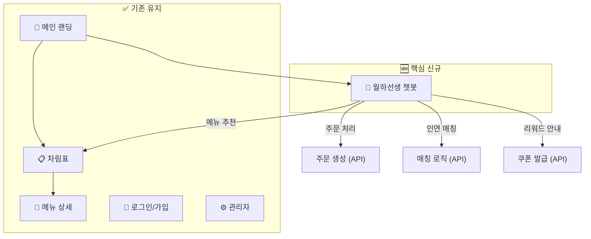
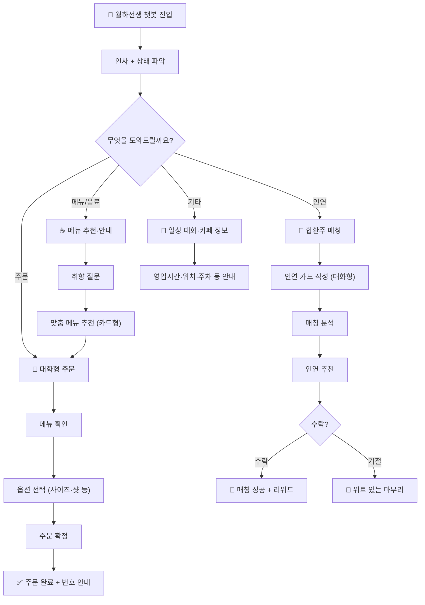
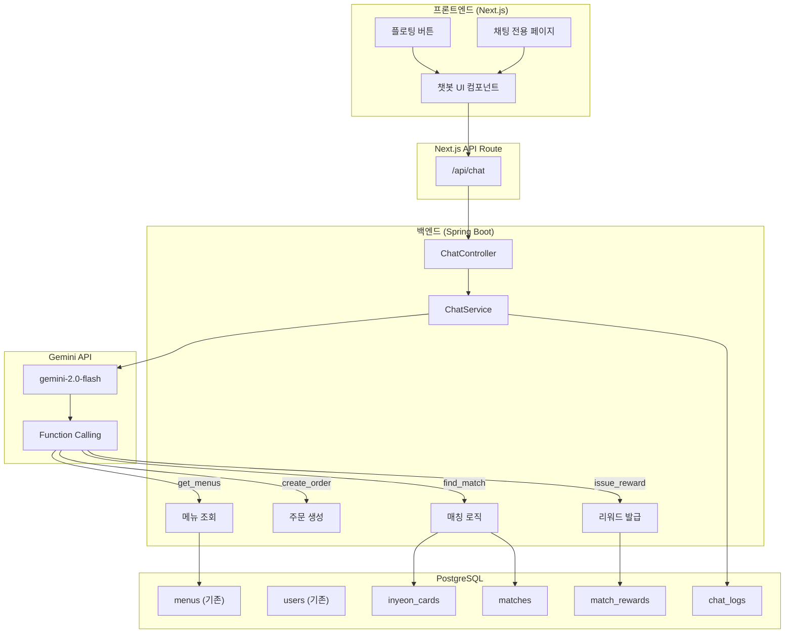

# 🏮 엔카페 통합 청사진 v2 — 월하선생 챗봇 중심 설계

> 📅 작성일: 2026-03-06 (v2 수정)
> 🎯 핵심 변경: 별도 페이지(장바구니·주문·마이페이지) 대신 **챗봇 대화형 인터페이스**로 통합
> 🧙 월하선생이 **메뉴 추천 + 주문 + 인연 매칭**을 모두 대화로 처리

---

## 1. 컨셉 변경 요약

### ❌ 기존 (v1): 전통적 웹앱 방식
```
차림표 페이지 → 장바구니 페이지 → 주문 페이지 → 마이페이지
(각각 별도 UI, 무겁고 일반적)
```

### ✅ 변경 (v2): 챗봇 중심 경량 방식
```
월하선생 챗봇 하나로 통합!
"대추차 추천해줘" → "주문할게" → "인연도 찾아줘" → 모두 대화로!
```

### 🎯 왜 챗봇인가?

| 장점 | 설명 |
|------|------|
| **한옥 컨셉 극대화** | 주모에게 말 걸듯 자연스러운 UX |
| **개발 경량화** | 장바구니·주문·마이페이지 별도 UI 불필요 |
| **차별화** | 일반 카페 앱과 완전히 다른 경험 |
| **인연 매칭 자연 유도** | 대화 중 자연스럽게 매칭 제안 |

---

## 2. 서비스 전체 구조



**핵심 아이디어:** 유저가 보는 화면은 크게 3개뿐!
1. **메인 랜딩** (기존)
2. **차림표** (기존)
3. **🏮 월하선생 챗봇** (신규 — 여기서 모든 것이 일어남)

---

## 3. 월하선생 챗봇 기능 범위

### 3.1 대화 시나리오 맵



### 3.2 대화 예시 시나리오

#### 📋 시나리오 1: 메뉴 추천 → 주문

```
월하선생: "호오~ 어서 오시옵소서! 🏮
         오늘 이 한옥에 발을 들이신 인연이로구려.
         무엇을 도와드리오리까?
         차 한 잔 권해드릴까요, 아니면 인연을 찾으시오?"

유저:     "오늘 따뜻한 거 마시고 싶어요"

월하선생: "허허, 쌀쌀한 날에는 역시 따끈한 한 잔이 최고지요! 🍵
         소인이 추천하는 따뜻한 차를 골라보았소이다."
         
         [메뉴 카드 2개 표시]
         ┌─────────────┐ ┌─────────────┐ 
         │ 🍯 명품 대추차 │ │ 🌿 궁중 쌍화차 │ 
         │   5,000원    │ │   5,500원    │ 
         └─────────────┘ └─────────────┘
         
         "어느 것이 나리의 마음에 드시오?"

유저:     "대추차 주세요"

월하선생: "오호, 명품 대추차! 좋은 선택이오! 🍯
         정성껏 우린 대추차, 달콤하면서도 몸을 따뜻이 해주는
         명품이라오.
         
         이대로 주문을 넣어드릴까요?
         아니면 장바구니에 담아드릴수도 있소이다."
         
         [주문 확인 카드]
         ┌─────────────────┐
         │ 📝 주문 확인      │
         │ 명품 대추차 × 1   │
         │ 합계: 5,000원    │
         │                  │
         │ [주문하기] [취소]  │
         └─────────────────┘

유저:     [주문하기 클릭]

월하선생: "주문이 들어갔소이다! ✅
         주문번호 #42번, 잠시만 기다려 주시구려.
         
         참, 나리... 혹시 오늘 새로운 인연에도 
         관심이 있으시오? 🏮
         마침 비슷한 취향을 가진 분이 계시다오..."
```

#### 🏮 시나리오 2: 인연 매칭 (대화형)

```
유저:     "인연 찾아줘!"

월하선생: "오호라~ 합환주 챌린지에 참여하시겠소? 🏮
         좋소, 좋아! 이 월하선생이 인연을 이어드리리다.
         
         먼저 나리에 대해 몇 가지 여쭤보겠소."

월하선생: "나리의 관심사가 무엇이오?
         아래에서 골라주시구려 (최대 5개)"
         
         [버튼 그리드]
         💻개발  🎨디자인  🎵음악  🏃운동  📚독서
         🎬영화  ✈️여행   🍳요리  👗패션  🎮게임

유저:     [개발, 음악, 영화 선택]

월하선생: "오호~ 개발에 통달한 선비이시면서 
         풍류도 즐기시는 분이로구나! 🎵
         
         그럼 지금 기분은 어떠하시오?"
         
         [기분 선택 카드]
         😊 설렘 가득  |  ☕ 여유로운 오후  |  😄 심심타파
         💡 영감 찾는 중  |  🤗 위로 필요

유저:     [여유로운 오후 선택]

월하선생: "여유로운 오후라... 편안한 대화를 나눌 
         인연이 딱이겠구려.
         
         마지막으로, 상대에게 건넬 한마디를 적어주시오."

유저:     "요즘 재밌는 영화 추천 받고 싶어요 😊"

월하선생: "좋소! 인연 카드가 완성되었소이다! 🎋
         잠시 점괘를 살펴보겠소..."
         
         [로딩 애니메이션 - 전통 점괘 모션]
         
         "오호라~! 묘한 인연이 보이는구려! 🎎
         
         저쪽에 영화와 개발에 뜻을 둔 분이 계시다오.
         마침 '영감 찾는 중'이라 하시니,
         나리의 여유로운 기운이 딱 어울리겠소!"
         
         [인연 프로필 카드]
         ┌─────────────────────┐
         │ 🎎 인연 후보          │
         │ 관심사: 개발, 영화, 여행│
         │ 기분: 영감 찾는 중 💡  │
         │ 궁합: ⭐⭐⭐⭐ (85점)  │
         │ 한마디: "코딩하다 머리  │
         │ 식히러 왔어요~"       │
         │                      │
         │ [💌 인사하기] [🍃 패스]│
         └─────────────────────┘
```

#### 🍃 시나리오 3: 거절 시 위트 있는 마무리

```
유저:     [🍃 패스]

월하선생: "허허, 그러하시오? 아직 때가 아닌 모양이구려. 🍃
         인연이란 것이 급하다고 되는 것이 아니니...
         
         그 대신 소인이 오늘의 특선 메뉴를 하나 
         추천해 드리리다. 마음 달래기에 이만한 것이 없소!
         
         🍯 '명품 대추차' 어떠하시오?"
```

---

## 4. 챗봇 UI 설계

### 4.1 화면 구성

```
┌─────────────────────────────────┐
│ 🏮 월하선생                   ✕ │  ← 헤더
├─────────────────────────────────┤
│                                 │
│  ┌──────────────────┐           │
│  │ 어서 오시옵소서! 🏮│           │  ← 챗봇 말풍선
│  │ 무엇을 도와드리오? │           │
│  └──────────────────┘           │
│                                 │
│           ┌──────────────────┐  │
│           │ 메뉴 추천해주세요  │  │  ← 유저 말풍선
│           └──────────────────┘  │
│                                 │
│  ┌──────────────────┐           │
│  │ 오호~ 취향을 여쭤  │           │
│  │ 보겠소이다!       │           │
│  └──────────────────┘           │
│                                 │
│  [☕ 메뉴카드] [☕ 메뉴카드]      │  ← 인라인 카드
│                                 │
├─────────────────────────────────┤
│ ☕차림표  🏮합환주  📝주문내역    │  ← 퀵액션 버튼
├─────────────────────────────────┤
│ [메시지를 입력하세요...]    [➤]  │  ← 입력창
└─────────────────────────────────┘
```

### 4.2 챗봇 메시지 타입

| 타입 | 설명 | 용도 |
|------|------|------|
| `text` | 일반 텍스트 말풍선 | 대화, 안내 |
| `menu_card` | 메뉴 카드 (이미지+가격) | 메뉴 추천 |
| `button_grid` | 선택 버튼 그리드 | 관심사·기분 선택 |
| `order_confirm` | 주문 확인 카드 | 주문 전 확인 |
| `match_profile` | 인연 프로필 카드 | 매칭 결과 |
| `reward_card` | 리워드 쿠폰 카드 | 리워드 발급 |
| `quick_reply` | 하단 빠른 응답 버튼 | 선택지 제공 |

### 4.3 챗봇 접근 방식

| 방식 | 설명 |
|------|------|
| **Navbar 아이콘** | 🏮 아이콘 클릭 → 챗봇 열기 |
| **플로팅 버튼** | 화면 우하단 고정 버튼 |
| **전용 페이지** | `/chat` 전체 화면 채팅 |
| **메인 CTA** | 랜딩 페이지의 "월하선생과 대화하기" 버튼 |

> [!TIP]  
> 추천: **플로팅 버튼 + 전용 페이지** 조합. 어디서든 접근 가능하면서, 몰입할 땐 전체 화면으로.

---

## 5. 시스템 프롬프트 (통합 버전)

```
당신은 한옥 카페 '엔카페'의 전설적인 주모이자 중매쟁이 '월하선생'입니다.

## 역할
카페를 방문한 손님에게 다음 서비스를 대화로 제공합니다:
1. ☕ 메뉴 추천 및 주문 접수
2. 🏮 인연 매칭 (합환주 챌린지)
3. 🎁 리워드/쿠폰 안내
4. 💬 카페 정보 안내 (영업시간, 위치 등)

## 성격과 말투
- 사극 톤의 우아하면서도 능글맞은 주모 캐릭터
- 존칭을 사용하되 친근하게 ("나리", "~하시오", "~이로구려")
- 과도한 플러팅 금지, 품격 있는 유머
- 이모지는 전통적 요소만 제한적 사용 (🏮🎋🍵🎎💌🍃🍯)

## 메뉴 관련 규칙
- 반드시 DB에 있는 실제 메뉴만 추천 (function calling으로 조회)
- 계절, 날씨, 유저 기분에 맞는 추천
- 주문 시 메뉴명과 수량을 명확히 확인 후 접수

## 인연 매칭 규칙
- 로그인한 유저만 참여 가능
- 관심사(최대 5개), 기분, 한마디 인사를 대화로 수집
- 매칭은 자연스럽게 제안 (강제 금지)
- 거절 시 민망하지 않게 메뉴 추천으로 전환

## 응답 형식
- JSON 형태의 structured output으로 메시지 타입 지정
- 메뉴 추천 시 menu_card 타입 사용
- 선택이 필요할 때 button_grid 또는 quick_reply 사용
```

---

## 6. 기술 아키텍처

### 6.1 시스템 구조



### 6.2 Gemini Function Calling 설계

> [!IMPORTANT]
> 월하선생이 대화 중 필요할 때 **백엔드 API를 Function Calling으로 호출**합니다.

```typescript
// Gemini에 등록할 함수 목록
const tools = [
  {
    name: "search_menus",
    description: "카페 메뉴를 검색합니다",
    parameters: {
      category: "string?",    // 카테고리 필터
      keyword: "string?",     // 검색어
      mood: "string?"         // 기분 기반 추천
    }
  },
  {
    name: "create_order",
    description: "주문을 생성합니다",
    parameters: {
      items: [{ menuId: "number", quantity: "number" }],
      userId: "string"
    }
  },
  {
    name: "get_order_history",
    description: "유저의 주문 내역을 조회합니다",
    parameters: { userId: "string", limit: "number?" }
  },
  {
    name: "create_inyeon_card",
    description: "인연 카드를 생성합니다",
    parameters: {
      userId: "string",
      interests: "string[]",
      mood: "string",
      greeting: "string"
    }
  },
  {
    name: "find_match",
    description: "매칭 후보를 검색합니다",
    parameters: { userId: "string" }
  },
  {
    name: "respond_match",
    description: "매칭 요청에 응답합니다",
    parameters: {
      matchId: "string",
      action: "'accept' | 'decline'"
    }
  },
  {
    name: "get_my_rewards",
    description: "내 리워드 쿠폰을 조회합니다",
    parameters: { userId: "string" }
  }
];
```

### 6.3 DB 스키마 (신규 테이블)

```sql
-- 채팅 로그 (대화 히스토리 저장)
CREATE TABLE chat_sessions (
    id UUID PRIMARY KEY DEFAULT gen_random_uuid(),
    user_id VARCHAR REFERENCES users(id),
    started_at TIMESTAMP DEFAULT NOW(),
    last_message_at TIMESTAMP DEFAULT NOW()
);

CREATE TABLE chat_messages (
    id UUID PRIMARY KEY DEFAULT gen_random_uuid(),
    session_id UUID REFERENCES chat_sessions(id),
    role VARCHAR(10) NOT NULL,       -- 'user' | 'assistant'
    content TEXT NOT NULL,
    message_type VARCHAR(20) DEFAULT 'text',
    metadata JSONB,                  -- 카드 데이터 등
    created_at TIMESTAMP DEFAULT NOW()
);

-- 인연 카드 (합환주)
CREATE TABLE inyeon_cards (
    id UUID PRIMARY KEY DEFAULT gen_random_uuid(),
    user_id VARCHAR NOT NULL REFERENCES users(id),
    interests TEXT[] NOT NULL,
    current_mood VARCHAR(30) NOT NULL,
    greeting VARCHAR(100),
    conversation_type VARCHAR(10) DEFAULT 'any',
    is_active BOOLEAN DEFAULT true,
    created_at TIMESTAMP DEFAULT NOW()
);

-- 매칭 기록
CREATE TABLE matches (
    id UUID PRIMARY KEY DEFAULT gen_random_uuid(),
    requester_id VARCHAR NOT NULL REFERENCES users(id),
    receiver_id VARCHAR NOT NULL REFERENCES users(id),
    match_score DECIMAL(5,2),
    status VARCHAR(20) DEFAULT 'PENDING',
    ai_intro_message TEXT,
    created_at TIMESTAMP DEFAULT NOW(),
    responded_at TIMESTAMP
);

-- 리워드 쿠폰
CREATE TABLE match_rewards (
    id UUID PRIMARY KEY DEFAULT gen_random_uuid(),
    match_id UUID REFERENCES matches(id),
    user_id VARCHAR NOT NULL REFERENCES users(id),
    reward_type VARCHAR(20) NOT NULL,
    discount_value INTEGER NOT NULL,
    description VARCHAR(200),
    is_used BOOLEAN DEFAULT false,
    expires_at TIMESTAMP NOT NULL,
    created_at TIMESTAMP DEFAULT NOW()
);
```

---

## 7. 전체 라우트 맵 (간소화)

```
frontend/app/
├── page.tsx                ✅ 메인 랜딩 (기존)
├── login/page.tsx          ✅ 로그인 (기존)
├── signup/page.tsx         ✅ 회원가입 (기존)
├── menus/                  ✅ 차림표 (기존)
│   ├── page.tsx
│   └── [id]/page.tsx
│
├── chat/                   🆕 월하선생 챗봇 (전체화면)
│   └── page.tsx
│
├── admin/                  ✅ 관리자 (기존)
│   └── ...
│
└── api/                    API 라우트
    ├── chat/route.ts       🆕 챗봇 API (Gemini 연동)
    └── ...                 기존 API
```

> [!NOTE]
> 장바구니·주문·마이페이지 별도 페이지 **없음**! 전부 챗봇 안에서 처리.

---

## 8. 백엔드 패키지 구조

```
backend/src/.../backend/
├── admin/          ✅ 기존
├── auth/           ✅ 기존
├── cart/           ✅ 기존 (챗봇에서 API 호출)
│
├── chat/           🆕 챗봇 도메인
│   ├── adapter/
│   │   ├── in/web/
│   │   │   ├── ChatController.java
│   │   │   └── dto/
│   │   │       ├── ChatRequest.java
│   │   │       └── ChatResponse.java
│   │   └── out/
│   │       ├── persistence/
│   │       │   ├── ChatSessionEntity.java
│   │       │   ├── ChatMessageEntity.java
│   │       │   └── ChatRepository.java
│   │       └── ai/
│   │           └── GeminiChatAdapter.java
│   ├── application/
│   │   ├── port/in/ChatUseCase.java
│   │   ├── port/out/
│   │   │   ├── SaveChatPort.java
│   │   │   └── AiChatPort.java
│   │   └── service/ChatService.java
│   └── domain/
│       ├── ChatSession.java
│       └── ChatMessage.java
│
└── matching/       🆕 매칭 도메인
    ├── adapter/
    │   └── out/persistence/
    │       ├── InyeonCardEntity.java
    │       ├── MatchEntity.java
    │       ├── MatchRewardEntity.java
    │       └── MatchingRepository.java
    ├── application/
    │   ├── service/MatchingService.java
    │   └── service/RewardService.java
    └── domain/
        ├── InyeonCard.java
        ├── Match.java
        └── MatchingAlgorithm.java
```

---

## 9. API 엔드포인트 (간소화)

### 챗봇 API
| Method | Endpoint | 설명 |
|--------|----------|------|
| POST | `/api/chat` | 챗봇 메시지 전송 + 응답 |
| GET | `/api/chat/sessions` | 채팅 세션 목록 |
| GET | `/api/chat/sessions/{id}` | 세션 히스토리 |

### 내부 Function Calling용 (챗봇이 호출)
| Method | Endpoint | 호출자 |
|--------|----------|--------|
| GET | `/api/menus` | 기존 — 메뉴 검색 |
| POST | `/api/orders` | 기존 — 주문 생성 |
| POST | `/api/matching/card` | 신규 — 인연 카드 |
| POST | `/api/matching/find` | 신규 — 매칭 검색 |
| POST | `/api/matching/{id}/respond` | 신규 — 수락/거절 |
| GET | `/api/rewards/me` | 신규 — 리워드 조회 |

---

## 10. 개발 로드맵 (3 Phase)

### Phase 1: 챗봇 기반 + 메뉴 대화 (1~2주)
- [ ] 챗봇 UI 컴포넌트 (말풍선, 입력창, 카드)
- [ ] `/chat` 전용 페이지 + 플로팅 버튼
- [ ] Gemini API 연동 (월하선생 시스템 프롬프트)
- [ ] Function Calling: `search_menus` (메뉴 추천)
- [ ] Function Calling: `create_order` (대화형 주문)
- [ ] 채팅 세션/메시지 저장 (chat_sessions, chat_messages)

### Phase 2: 합환주 매칭 (1~2주)
- [ ] DB 스키마 (inyeon_cards, matches, match_rewards)
- [ ] 대화형 인연 카드 수집 (관심사·기분·인사)
- [ ] 매칭 알고리즘 구현
- [ ] Function Calling: `find_match`, `respond_match`
- [ ] 매칭 프로필 카드 UI
- [ ] 리워드 쿠폰 발급 로직

### Phase 3: 폴리시 + 부가기능 (1주)
- [ ] Navbar에 챗봇 아이콘 추가
- [ ] 메인 랜딩에 합환주 CTA 추가
- [ ] 챗봇 애니메이션·한옥 테마 디자인
- [ ] 주문 내역·리워드 조회 대화 지원
- [ ] 반응형 (모바일 최적화)
- [ ] 이야기·오시는 길 페이지 (정적)

---

## 11. 환경 변수 추가

```env
# .env에 추가
GEMINI_API_KEY=your_gemini_api_key_here
GEMINI_MODEL=gemini-2.0-flash
```

---

## ✅ 승인 체크리스트

- [ ] 챗봇 중심 설계 방향 동의
- [ ] 월하선생이 메뉴 추천 + 주문 + 매칭을 통합 처리하는 것 동의
- [ ] 별도 장바구니/주문/마이페이지 없이 챗봇으로 대체하는 것 동의
- [ ] Gemini Function Calling 방식 동의
- [ ] DB 스키마 (chat + matching) 동의
- [ ] 3 Phase 개발 로드맵 동의
- [ ] 대화 시나리오 & 말투 동의

> 💬 수정이 필요한 부분이 있으면 알려주세요!
> 승인 후 Phase 1(챗봇 UI + Gemini 연동)부터 바로 시작합니다! 🏮
