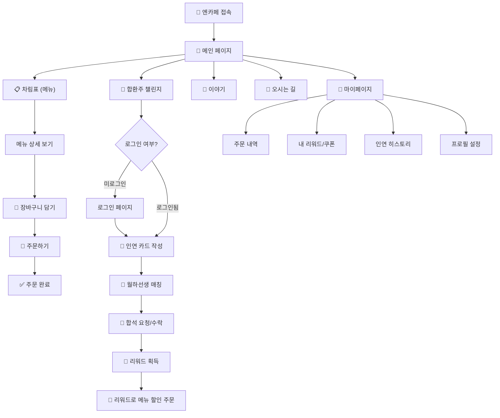
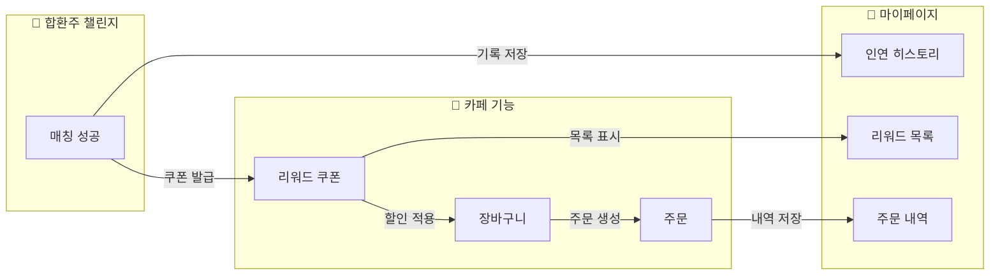

# 🏮 엔카페 통합 서비스 청사진 — 합환주 챌린지 + 유저 기능

> 📅 작성일: 2026-03-06
> 🎯 메인 기능: 합환주 챌린지 (AI 인연 매칭)
> 🍵 서브 기능: 카페 유저 필수 기능 (주문, 장바구니, 마이페이지 등)

---

## 1. 서비스 전체 구조

### 🎯 핵심 콘셉트

**"한옥 카페에서 차 한 잔의 인연을 잇다"**

합환주 챌린지가 **차별화된 메인 기능**이고, 일반 카페 기능(메뉴 조회·주문·장바구니)은 그 기반을 닦는 **필수 인프라**입니다.

### 📊 기능 우선순위 매트릭스

| 우선순위 | 기능 | 상태 | 역할 |
|---------|------|------|------|
| ⭐ 메인 | 합환주 챌린지 (AI 매칭) | 🆕 신규 | 서비스의 핵심 차별점 |
| 🔵 기반 | 메뉴 조회 (차림표) | ✅ 완료 | 카페 기본 기능 |
| 🔵 기반 | 회원가입/로그인 | ✅ 완료 | 인증 인프라 |
| 🟡 필수 | 장바구니 | 🔧 백엔드만 | 주문 전 단계 |
| 🟡 필수 | 주문하기 | 🔧 백엔드만 | 카페 핵심 기능 |
| 🟡 필수 | 마이페이지 | 🆕 신규 | 주문내역·리워드 통합 |
| 🟢 부가 | 이야기 (카페 소개) | 🆕 신규 | 브랜딩 |
| 🟢 부가 | 오시는 길 | 🆕 신규 | 정보 제공 |

---

## 2. 통합 사용자 흐름도



---

## 3. 전체 라우트 맵

### 현재 상태 vs 목표

```
frontend/app/
├── page.tsx                    ✅ 메인 랜딩
├── login/page.tsx              ✅ 로그인
├── signup/page.tsx             ✅ 회원가입
│
├── menus/                      ✅ 유저 메뉴 조회
│   ├── page.tsx                ✅ 차림표 (목록)
│   └── [id]/page.tsx           ✅ 메뉴 상세
│
├── cart/                       🆕 장바구니
│   └── page.tsx                   장바구니 화면
│
├── order/                      🆕 주문
│   ├── page.tsx                   주문서 작성
│   └── complete/page.tsx          주문 완료
│
├── matching/                   🆕 ⭐ 합환주 챌린지
│   ├── page.tsx                   챌린지 소개 + 참여
│   ├── card/page.tsx              인연 카드 작성
│   ├── result/page.tsx            매칭 결과
│   ├── chat/page.tsx              월하선생 대화
│   └── rewards/page.tsx           매칭 리워드
│
├── mypage/                     🆕 마이페이지
│   ├── page.tsx                   대시보드 (요약)
│   ├── orders/page.tsx            주문 내역
│   ├── rewards/page.tsx           리워드/쿠폰 목록
│   └── profile/page.tsx           프로필 설정
│
├── story/page.tsx              🆕 카페 이야기
├── locations/page.tsx          🆕 오시는 길
│
├── admin/                      ✅ 관리자 (기존)
│   ├── menus/                  ✅ 메뉴 관리
│   └── ...
│
└── api/                        프록시 라우트
```

---

## 4. 유저 기능 상세 설계

### 4.1 🛒 장바구니

> [!NOTE]
> 백엔드에 `CartController`, `CartPersistenceAdapter` 가 이미 구현되어 있음. 프론트엔드 UI만 추가 필요.

**화면 구성:**
- 담은 메뉴 목록 (이미지, 이름, 가격, 수량 조절)
- 옵션별 추가금 표시
- 합계 금액
- 쿠폰 적용 버튼 (합환주 리워드 연동!)
- "주문하기" 버튼

**리워드 연동 포인트:**
```
장바구니 → 쿠폰 적용 → 할인 계산 → 주문
                ↑
        합환주 리워드 쿠폰이 여기서 사용됨!
```

### 4.2 📝 주문하기

**주문 플로우:**
1. 장바구니에서 "주문하기" 클릭
2. 주문서 확인 (메뉴, 수량, 옵션, 할인)
3. 테이블 번호 or 픽업 선택
4. 주문 확정
5. 주문 완료 화면 (주문번호 표시)

**데이터 모델 (기존 확장):**
```typescript
interface Order {
  id: string;
  userId: string;
  items: OrderItem[];
  totalPrice: number;
  discountAmount: number;       // 쿠폰 할인
  appliedRewardId?: string;     // 적용된 합환주 리워드
  status: 'PENDING' | 'PREPARING' | 'READY' | 'COMPLETED';
  orderType: 'DINE_IN' | 'PICKUP';
  tableNumber?: number;
  createdAt: Date;
}
```

### 4.3 👤 마이페이지

**대시보드 구성:**
```
┌─────────────────────────────────────┐
│  👤 {닉네임}님, 어서 오시옵소서! 🏮  │
├──────────┬──────────┬───────────────┤
│ 주문 3건  │ 쿠폰 2장 │ 인연 1회 성공  │
├──────────┴──────────┴───────────────┤
│ 📋 최근 주문                         │
│  ─ 흑임자 크림 라떼 × 1  (오늘)      │
│  ─ 약과 휘낭시에 × 2     (어제)      │
├─────────────────────────────────────┤
│ 🎁 사용 가능한 리워드                 │
│  ─ 🌱 첫 인연 쿠폰: 약과 무료        │
├─────────────────────────────────────┤
│ 🎋 나의 인연 히스토리                 │
│  ─ 3/5 매칭 → 개발 이야기로 꽃 핌 🌸 │
└─────────────────────────────────────┘
```

### 4.4 📖 이야기 (카페 소개) 페이지

한옥 카페의 브랜딩과 스토리를 전하는 정적 페이지:
- 카페 탄생 스토리
- 공간 소개 (한옥 인테리어 갤러리)
- 철학과 가치
- 합환주 챌린지 소개 (매칭 기능으로 자연스럽게 유도)

### 4.5 📍 오시는 길

- 카카오맵/네이버맵 임베드
- 주소, 영업시간, 전화번호
- 주차 안내

---

## 5. 네비게이션 바 리뉴얼

**현재 Navbar:**
```
🍵 엔카페  |  차림표  |  이야기  |  오시는 길  |  [로그인] [자리 예약]
```

**개선안 (합환주 메인 강조):**
```
🍵 엔카페  |  차림표  |  🏮 합환주  |  이야기  |  오시는 길  |  🛒  |  👤  |  [로그인]
```

| 요소 | 변경 사항 |
|------|-----------|
| **🏮 합환주** | 메인 기능 강조 (글로우 효과 또는 뱃지) |
| **🛒 장바구니** | 아이콘 + 담긴 수량 뱃지 |
| **👤 마이페이지** | 로그인 시 닉네임 드롭다운 |
| **자리 예약** | 합환주 참여 시 자동 자리 배정으로 전환 |

---

## 6. 백엔드 API 전체 맵

### 기존 API (구현됨)
| Method | Endpoint | 설명 |
|--------|----------|------|
| POST | `/api/auth/signup` | 회원가입 |
| POST | `/api/auth/login` | 로그인 |
| GET | `/api/menus` | 메뉴 목록 |
| GET | `/api/menus/{id}` | 메뉴 상세 |
| POST | `/api/cart` | 장바구니 추가 |
| GET | `/api/cart` | 장바구니 조회 |

### 유저 기능 신규 API
| Method | Endpoint | 설명 |
|--------|----------|------|
| DELETE | `/api/cart/{itemId}` | 장바구니 항목 삭제 |
| PATCH | `/api/cart/{itemId}` | 장바구니 수량 변경 |
| POST | `/api/orders` | 주문 생성 |
| GET | `/api/orders/me` | 내 주문 내역 |
| GET | `/api/orders/{id}` | 주문 상세 |
| GET | `/api/mypage/summary` | 마이페이지 요약 |

### 합환주 챌린지 API (신규)
| Method | Endpoint | 설명 |
|--------|----------|------|
| POST | `/api/matching/card` | 인연 카드 생성 |
| GET | `/api/matching/card/me` | 내 인연 카드 |
| POST | `/api/matching/find` | 매칭 후보 검색 |
| POST | `/api/matching/{id}/accept` | 매칭 수락 |
| POST | `/api/matching/{id}/decline` | 매칭 거절 |
| GET | `/api/rewards/me` | 내 리워드 |
| POST | `/api/rewards/{id}/use` | 리워드 사용 |

---

## 7. 통합 개발 로드맵

### Phase 1: 유저 기반 기능 (1~2주)
- [ ] 장바구니 프론트엔드 UI (`/cart`)
- [ ] 주문 프론트엔드 + 백엔드 완성 (`/order`)
- [ ] 마이페이지 기본 구조 (`/mypage`)
- [ ] Navbar 리뉴얼 (합환주 링크 + 장바구니 + 마이페이지)

### Phase 2: 합환주 코어 (1~2주)
- [ ] DB 스키마 (inyeon_cards, matches, match_rewards)
- [ ] 인연 카드 CRUD + 매칭 알고리즘
- [ ] 합환주 소개 페이지 UI (`/matching`)
- [ ] 인연 카드 작성 폼 UI (`/matching/card`)

### Phase 3: AI + 리워드 (1~2주)
- [ ] Gemini API 연동 (월하선생 시스템 프롬프트)
- [ ] 매칭 결과 화면 + 합석 요청/수락 UI
- [ ] 리워드 쿠폰 발급 + 장바구니 할인 연동
- [ ] 마이페이지에 인연 히스토리·리워드 통합

### Phase 4: 부가 기능 + 폴리시 (1주)
- [ ] 이야기 페이지 (`/story`)
- [ ] 오시는 길 페이지 (`/locations`)
- [ ] 전체 UX 폴리시 + 애니메이션
- [ ] 반응형 (모바일) 최적화

---

## 8. 핵심 연동 포인트: 합환주 ↔ 카페 기능

> [!IMPORTANT]
> 합환주 챌린지가 **독립된 미니게임이 아니라**, 카페 본연의 기능과 자연스럽게 연결되는 것이 핵심입니다.



**시나리오 예시:**
1. 유저가 합환주 챌린지에서 매칭 성공 → 🎁 "약과 1개 무료" 쿠폰 발급
2. 마이페이지에서 쿠폰 확인
3. 차림표에서 약과 휘낭시에를 장바구니에 담기
4. 장바구니에서 쿠폰 적용 → 8,000원 → **0원**
5. 주문 완료!

---

## ✅ 승인 체크리스트

- [ ] 합환주 챌린지를 메인으로 하는 전체 구조 동의
- [ ] 유저 기능 범위 (장바구니, 주문, 마이페이지) 동의
- [ ] 라우트 맵 동의
- [ ] Navbar 리뉴얼 방향 동의
- [ ] 합환주 ↔ 카페 기능 연동 방식 동의
- [ ] 4 Phase 개발 순서 동의

> 💬 수정하고 싶은 부분이 있으면 말씀해 주세요!
